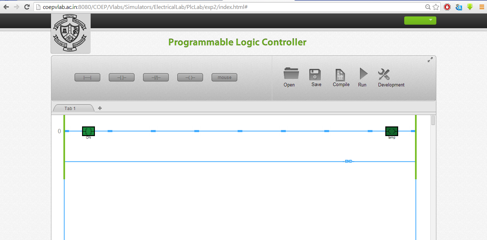
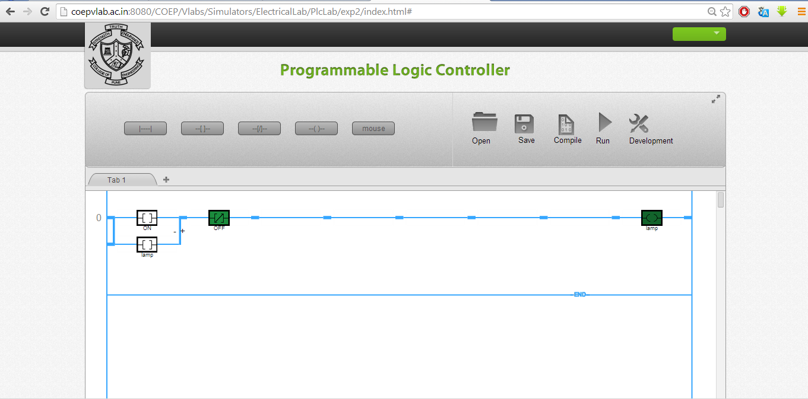

### Procedure
### Important steps for developing Ladder using Simulator:
Please follow the steps so as to understand the procedure for developing ladder logic for various logical gates.
##### 1.Prior to starting of the development of ladder diagram following steps needs to be understood:
a. Understand the problem statement like test the logic for OR gate, AND Gate etc.
b. Develop the logic on paper and validate the logic by considering various cases
c. Prepare the truth table and test the logic using all valid cases
d. Go to simulator icon and click on the “Simulator” button
e. The PLC simulator will be opened in new window.

##### 2.The procedure for writing the ladder diagram in the work space is as follows:
a. The screen shot for the first window will appear like this.

Add a new rung by clicking on the 'Add Rung' icon. The window will appear like this:

b. Place the contacts as per the requirement by left clicking the appropriate contact shown at the top side. In the example demonstrated below one normally contact and one coil is placed as shown the figure.

c. Right click on the contact or coil and you can give tag name like “start”, “stop” etc. Please ensure that the tag numbers are true replica of process connections. Similarly give tag name to coil like “motor”, “Lamp” etc. The final ladder will look like this.

d. Please note that the tag names are case sensitive and if you are using them in circuit as bit make sure that the correct tag name appears.
e. Click the Compile button so the ladder will be ready for running. For testing the logic you need to click on Run. Both sides of the rung will become green and this is the indication of run mode. Please not that in run mode you can't make changes in the ladder. For modifications user has to go to development mode.
f. By right clicking on the contact toggle the state of contact.Check the output contact status.

g. Please remember the ladder contacts or the state of the inputs and outputs are always in de-energised state. The de-energised is that state wherein the contacts are in non-active state.
h. You can once again toggle the contact and the output state will change. To add any contact you will have to go to development mode. Click on the rung and add contacts.
i. To delete any contact or output right click on the contact and press “delete”, the contact will be deleted.
j. You can add seven elements in series and 5 elements in parallel.
l. To add element in parallel click on the node near contact where you wish to add parallel branch. Select the branch and click on the '+' sign to complete the loop. The screen will appear as shown below.

m. Repeat the procedure and verify your logic.
n. Similarly you can check the logic for OR, NOR, and NAND gates. Validate the truth tables and confirm the results.
