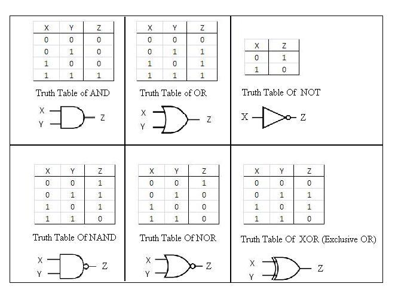
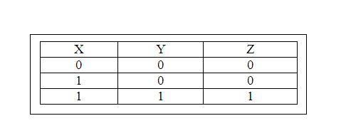
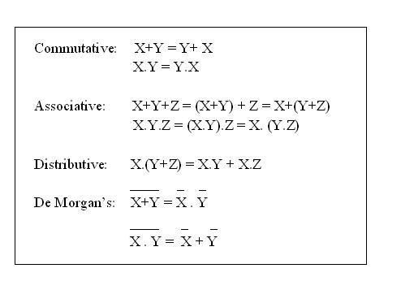
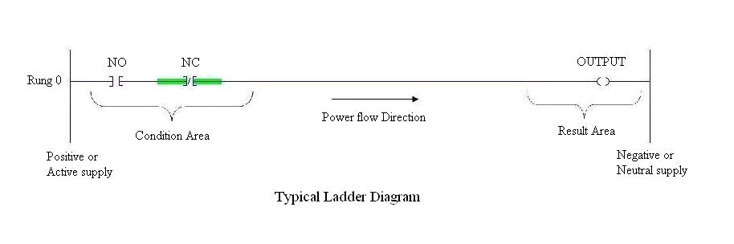
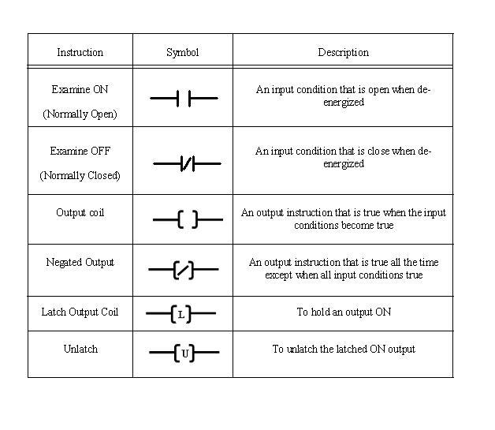

### Pre-requisites:-
##### Basics of Digital Electronics and Boolean Algebra:
Digitization is a process where continuous analog signal is converted into a finite number of discrete states. These states are well separated so that noise does not create errors.

The resulting digital signal has following advantages:
1. storage over arbitrary periods of time.
2. flawless retrieval and reproduction of the stored information.
3. flawless transmission of the information.

Some information is essentially digital. Hence it is natural to process and manipulate such information using purely digital techniques. Examples are numbers and words.
The drawback to digitization is that a single analog signal (e.g. a voltage which is a function of time, like a stereo signal) needs many discrete states, or bits, in order to give a satisfactory reproduction.
', 'l'
    

### Logic

What can a digital circuit do?
The simplest task we can think of is a combinational type of logic decision. For example, we can design a digital electronic circuit to make an instant decision based on some information. Here we emphasize “instant” in the decision making process. That means, the process has no time delay.
, is used to determine temperature.

X = It is a sunny day? Yes \
Y = Is it Sunday or holiday? Yes \
Action Z = Go for shopping \
The rule is Z = X and Y. The circuit is a simple AND gate. 
### Truth Tables:

### Boolean Algebra:
Logic can also be expressed in algebraic form.
e.g.Truth Table for AND gate:

### Boolean Algebra Simplification:-
### Basic Laws:

### Theory
##### Introduction

Each manufacturer of PLC systems has own style of writing the instructions. Different PLCs has different instruction sets but even some common basic instructions are shared by all the PLCs. All manufacturers give different software packages for programming PLCs. Ladder is most commonly used programming language. Prior to PLCs, relay logic was used in industry. Ladders were developed to mimic or imitate relay logic.

Relay Logic / Instructions
A relay is simple magnetic device which acts as a control switch.
When the switch is on, current will flow through the coil on iron piece. This iron core acts a electromagnet and due to the magnetic field upper contact gets attracted towards lower one and circuit gets completed, allowing current to flow from load.
##### Ladder Programming

Ladder diagram is popular language of programming the PLCs. Ladder diagram shows the sequence of the logic execution which is presented diagrammatically. In ladder diagram, There are two vertical lines generally called as Phase (positive) or neutral. Rungs which show current flow in horizontal direction are the sequence in which the logic executes. The Analogous to relay, ladder has two main symbols which are contacts and output coil. Generally each rung has inputs (contacts) on left hand side and outputs (coil) on the right hand side. These contacts and coils are called as bits of the relays. Each input and output are individual bit in I/O files. An instruction in ladder instructs PLCs how to respond to the bits in I/O files which are stored in the memory. Input contacts are the condition area, the conditions must be fulfilled to change the status of the output coils.
    

Most commonly used relay instructions used in PLC programming are as shown in the table below.
    

